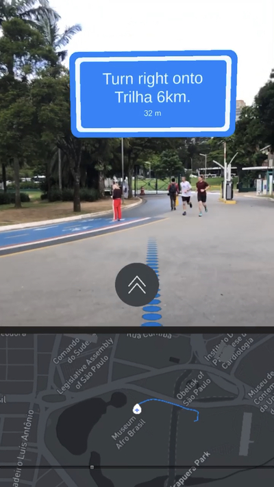

# Unity AR+GPS Location - Mapbox Routes Sample Project With Map View 

## Usage

* Clone or download this repository and open it on Unity 2020.3 or newer.
* Import the [Unity AR+GPS Location](https://assetstore.unity.com/packages/tools/integration/ar-gps-location-134882) asset into the project.
* Build the `_Project/Scenes/Mapbox Route` scene and deploy it to your device!

